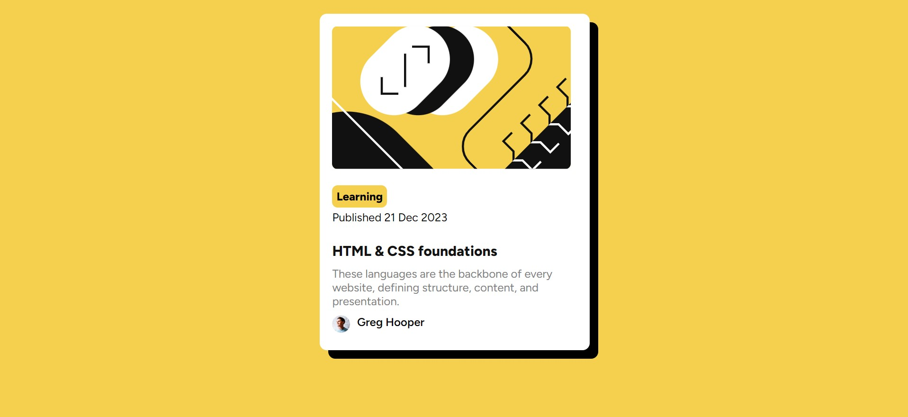

# Frontend Mentor - Blog preview card solution

This is a solution to the [Blog preview card challenge on Frontend Mentor](https://www.frontendmentor.io/challenges/blog-preview-card-ckPaj01IcS). Frontend Mentor challenges help you improve your coding skills by building realistic projects. 

## Table of contents

- [Overview](#overview)
  - [The challenge](#the-challenge)
  - [Screenshot](#screenshot)
  - [Links](#links)
- [My process](#my-process)
  - [Built with](#built-with)
  - [What I learned](#what-i-learned)
  - [Continued development](#continued-development)
  - [Useful resources](#useful-resources)
- [Author](#author)


## Overview

### The challenge

Users should be able to:

- See hover and focus states for all interactive elements on the page

### Screenshot




### Links

- Solution URL: [Blog Preview Card](https://github.com/Visvas07/Blog-Preview-Card)
- Live Site URL: [Add live site URL here](https://your-live-site-url.com)

## My process

### Built with

- Semantic HTML5 markup
- CSS custom properties
- Flexbox
- CSS Grid
- CSS Media Query


### What I learned

I was initially not good at making cards as I couldn't understand the syntax or the structure of the card. However, after looking through some tutorials, I was able to understand and now able to create the cards.
To see how you can add code snippets, see below:

```html
<div class="blog-preview-card">
    <div class="card-title">
      
      <div class="card-details">
        <span class="title">Learning</span>
      <p class="pub-date">Published 21 Dec 2023</p>
      </div>
    </div>
      <div class="blog-description">
       <span class="blog-title">HTML & CSS foundations</span>
        <p class="blog-details">These languages are the backbone of every website, defining structure, content, and presentation.</p>
        <div class="blog-author">
          <span class="author-name">Greg Hooper</span>
        </div>
        
        
      </div>
    
  </div>
```
```css
.blog-preview-card{
    background-color: #fff;
    border-radius: 10px;
    height: 80vh;
    width: 380px;
    margin :20px;
    padding:1.1rem;
    box-shadow: 12px 12px;
    transition: 1s;
}
```


### Continued development

With this project, it would be good to implement cards for responsive web projects.

### Useful resources

- [W3schools](https://www.w3schools.com/) - This website is very useful when it comes to HTML,CSS and JS. It curates the best practices and code snippets for each element of a website and helps us to gain insights and implement the best in our projects.


## Author

- Website - [Visvas Nagarajan](https://www.visvas-tech.com)
- Frontend Mentor - [@Visvas07](https://www.frontendmentor.io/profile/Visvas07)


